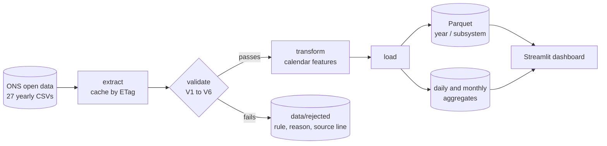

# energy-load-etl

Batch pipeline for 26 years of Brazilian electricity load data, from raw CSV to a
dashboard in production.

**[Live dashboard](https://energia.gabrielfdev.com)** · 


[Versão em português](README.pt-BR.md)

933,880 hourly measurements published by ONS, the Brazilian grid operator, downloaded
with cache invalidation, put through six validation rules, written to partitioned
Parquet and served by a Streamlit dashboard that refreshes itself twice a day.

Rows that fail validation are not dropped in silence. They go to a quality report with
the rule that caught them, the reason, and the line of the file they came from.

## The problem

Brazil publishes its electricity consumption openly, one CSV per year since 2000. It is
good data, and it looks simple: four columns, one row per hour per subsystem. Load it
and you are done.

Except you are not, and the reason is in the timestamps. That is what this project is
actually about.

## How it works



One command runs everything:

```bash
uv run python -m energy_load_etl.pipeline
```

It takes about 6 seconds for all 27 years when the files are already cached, and writes
933,620 approved rows across 108 Parquet partitions.

## The interesting part

Brazil observed daylight saving time until 2019. The plan for this project said the
data would have one 23 hour day and one 25 hour day per year. Half of that turned out to
be wrong, and finding out was the best thing that happened here.

**25 hour days do not exist in the files.** When clocks went back in February, 11 PM
happened twice, with different load each time. The ONS format uses the local timestamp
as a key and has nowhere to put the second reading, so one real measurement was dropped
at the source. That is exactly 4 lost hours per year, one per subsystem, every year from
2000 to 2019, and zero from 2020 on, when the country abolished DST. The pipeline
detects this from the data alone, which means it reconstructed a change in public policy
out of a file format.

**23 hour days do exist, but only through 2013.** When clocks jumped forward in October,
ONS simply did not write the missing row. From 2014 on it started writing the row with an
empty value, so the day has 24 lines again. On 2018-11-04, three subsystems came in blank
and the South came in as `0E-8`.

The consequence runs through the whole codebase: **no count works.** There is no "24 rows
per day" and no "8,760 per year" that holds for every year, because there are rows that
are not hours and hours that have no row.

So nothing here counts rows. The validation asks `zoneinfo` for the grid of instants that
actually existed on the local clock and subtracts what arrived. No daylight saving date
appears anywhere in the code, and the same function answers both "is an hour missing?"
and "is this day complete?". Two independent code paths, one number: the missing hours
summed from the daily aggregate come to 368, and the validation reports 368.

## Validation rules

They run in this order. The first five block a row, the sixth flags it.

| Rule | What it checks | Effect |
|---|---|---|
| V1 | Schema: 4 columns with the contract types | blocks the file |
| V2 | Subsystem code in {N, NE, S, SE} | blocks the row |
| FUSO | Timestamp that never existed on the local clock | blocks the row |
| V5 | Missing value | blocks the row |
| V3 | Uniqueness of (subsystem, localized instant) | blocks the row |
| V5 | Physical range, 0 < load < 120,000 MWmed | blocks the row |
| V4 | Calendar continuity against the real timezone grid | reports the gap |
| V6 | Atypical jump between consecutive hours | flags for review |

Order matters. Timezone handling runs before the physical range check because on the DST
transition the South subsystem reports `0E-8` for the hour that did not exist. Rejecting
that as "zero load is impossible" would give the right verdict for the wrong reason: the
problem is not the value, it is the instant. Validation in the wrong order produces false
explanations.

The split between hard rules and alert rules is deliberate. V6 does not reject anything,
because the value is correct. What was unusual is what happened during that hour.

## What the data revealed

Found by the pipeline, without anyone looking for them.

**Three days with no measurement at all**: 2013-12-01, 2014-02-01 and 2015-04-09. In two
of them the North has no row at all while the other three have rows with empty values.
These days appear in the daily aggregate with `hours_present = 0` and null measurements,
rather than disappearing, so the chart draws a gap instead of a straight line.

**The ten largest jumps in 26 years are four blackouts and six World Cup matches.** The
blackouts: 2002-01-21, 2009-11-10 (the largest in the country's history), 2013-08-28 and
2018-03-21. The matches are all at 6 PM in the Southeast, as a rise between 7,283 and
9,022 MWmed. Stopping to watch a game is gradual; going back to work is abrupt, and it is
the return that trips the rule.

**April 2020 in the North subsystem** has three times its normal hour to hour variability,
sustained for a month, back to normal in May. Lockdown would explain a drop in level, not
a tripling of variability. Cause unknown, and left in the report as an open question.

## Running it

Requires [uv](https://docs.astral.sh/uv/) and Python 3.12.

```bash
git clone https://github.com/dev-gabrielferreira/energy-load-etl.git
cd energy-load-etl
uv sync

uv run python -m energy_load_etl.pipeline     # download, validate, write Parquet
uv run streamlit run dashboard/app.py         # dashboard on localhost:8501
```

The first run downloads about 39 MB from the ONS S3 bucket. After that the extract
compares ETags and only downloads a year again when the remote file changed, which
happens more often than you would expect: ONS revises published data retroactively.

```bash
uv run python -m energy_load_etl.pipeline --sem-download   # use what is in data/raw
uv run python -m energy_load_etl.pipeline --anos 2018 2019 # specific years
uv run pytest                                              # 56 tests
```

## What it writes

| Path | Contents |
|---|---|
| `data/raw/` | CSVs exactly as ONS published them, never edited |
| `data/processed/horario/ano=YYYY/id_subsistema=XX/` | hourly data, 933,620 rows in 108 partitions |
| `data/processed/diario/`, `mensal/` | aggregates, each row declaring how many hours it is made of |
| `data/processed/qualidade/` | rows read, approved and rejected, year by year |
| `data/rejected/` | every rejected row with its rule and source line, plus a Markdown report |

The Parquet output is 33 MB against 39 MB of raw CSV, while carrying twelve extra
columns. `data/` is gitignored and nothing in it is committed.

## Aggregates that tell you what they are made of

Every row in the daily and monthly tables carries `horas_esperadas` (hours expected),
`horas_presentes` (hours present) and `completo` (complete). The expected count comes
from the timezone grid, never from a hardcoded 24, which matters for 39 days in the
history: 20 days of 25 hours and 19 days of 23.

A day that lost six hours would otherwise produce an average that looks exactly as solid
as a full day's. Monthly figures are computed from hourly data rather than from the daily
table, because averaging daily averages would weigh a six hour day the same as a complete
one.

## Project layout

```
src/energy_load_etl/
├── config.py      constants, paths, thresholds
├── extract.py     download with ETag cache, CSV reading, timezone localization
├── validate.py    V1 to V6
├── transform.py   the timezone grid and calendar features
├── aggregate.py   daily and monthly, with completeness
├── load.py        partitioned Parquet, idempotent writes
└── pipeline.py    single entry point
dashboard/app.py   Streamlit, reads only data/processed
tests/             56 tests, synthetic fixtures, real DST dates
```

Each module does one thing and is testable on its own.

## Tests

```bash
uv run pytest
```

56 tests over synthetic fixtures small enough to read. Every case in them was observed in
the real ONS data before becoming a test, and the daylight saving cases use the real
transition dates, because testing against an invented date would not prove the code talks
correctly to the timezone database.

## Deployment

Two containers from one image, behind Caddy. The pipeline reprocesses every 12 hours and
writes to a volume; the dashboard reads that volume and serves the page. Full walkthrough
in [docs/DEPLOY.md](docs/DEPLOY.md).

One detail worth knowing if you containerize anything that handles time: `python:3.12-slim`
does not ship the timezone database. Without `tzdata`, `zoneinfo` does not know
`America/Sao_Paulo` and this pipeline dies on the first row it tries to localize.

## Design decisions

Every choice, with what was rejected and why, is in
[docs/decisions.md](docs/decisions.md). Among them: pandas over Polars, Parquet over CSV,
explicit partition folders over `partition_cols`, keeping the local timezone label instead
of UTC, and why rejected rows are kept instead of dropped.

## Data source

[Curva de Carga Horária](https://dados.ons.org.br/dataset/curva-carga-ho), published by
the Operador Nacional do Sistema Elétrico (ONS) under CC-BY. This project is not an
official ONS product.
