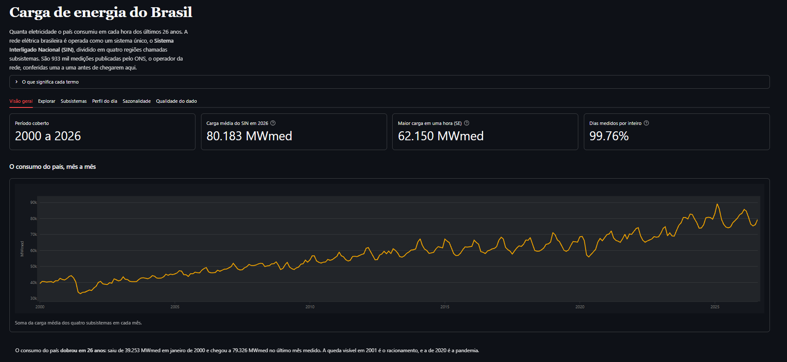
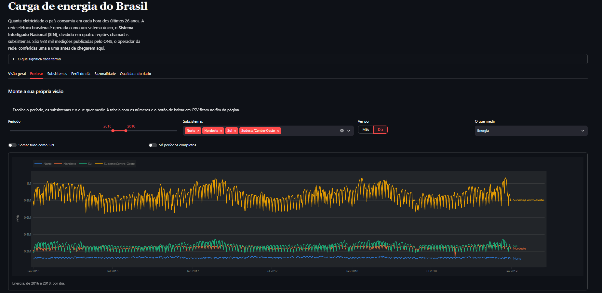
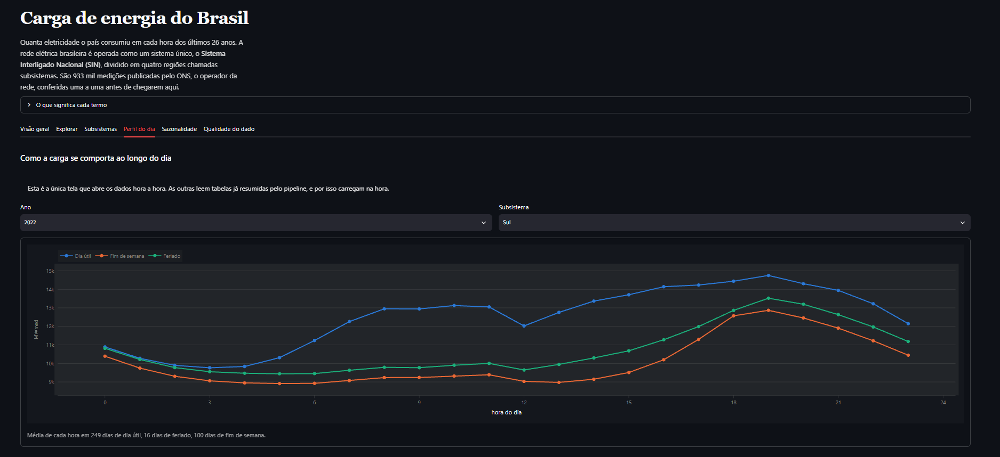
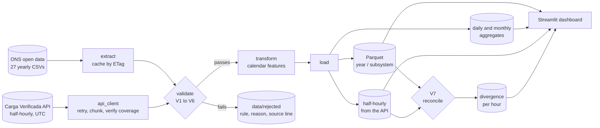

# energy-load-etl

Batch pipeline for 26 years of Brazilian electricity load data, from raw CSV to a
dashboard in production.

**[Live dashboard](https://energia.gabrielfdev.com)** · 
[Versão em português](README.pt-BR.md)





933,880 hourly measurements published by ONS, the Brazilian grid operator, downloaded
with cache invalidation, put through seven validation rules, written to partitioned
Parquet and served by a Streamlit dashboard.

Two sources feed it. The yearly CSV files are the history, and they arrive a few days
late. A REST API of half-hourly readings covers that gap and refreshes every three hours.
Both go through the same validation funnel, and they are kept in separate tables, because
they turned out not to measure the same thing.

Rows that fail validation are not dropped in silence. They go to a quality report with
the rule that caught them, the reason, and the line of the file they came from.

## The problem

Brazil publishes its electricity consumption openly, one CSV per year since 2000. It is
good data, and it looks simple: four columns, one row per hour per subsystem. Load it
and you are done.

Except you are not, and the reason is in the timestamps. That is what this project is
actually about.

## How it works



Two commands, one per source:

```bash
uv run python -m energy_load_etl.pipeline                # the 27 yearly files
uv run python -m energy_load_etl.pipeline --incremental  # the last 30 days from the API
```

The full run takes about 6 seconds for all 27 years when the files are already cached, and
writes 933,620 approved rows across 108 Parquet partitions. The incremental run takes a
couple of seconds and never touches the history.

## The interesting part

Brazil observed daylight saving time until 2019. The plan for this project said the
data would have one 23 hour day and one 25 hour day per year. Half of that turned out to
be wrong, and finding out was the best thing that happened here.

**25 hour days do not exist in the files.** When clocks went back in February, 11 PM
happened twice, with different load each time. The ONS format uses the local timestamp
as a key and has nowhere to put the second reading, so one real measurement was dropped
at the source. That is exactly 4 lost hours per year, one per subsystem, every year from
2000 to 2019, and zero from 2020 on, when the country abolished DST. The pipeline
detects this from the data alone, which means it reconstructed a change in public policy
out of a file format.

**23 hour days do exist, but only through 2013.** When clocks jumped forward in October,
ONS simply did not write the missing row. From 2014 on it started writing the row with an
empty value, so the day has 24 lines again. On 2018-11-04, three subsystems came in blank
and the South came in as `0E-8`.

The consequence runs through the whole codebase: **no count works.** There is no "24 rows
per day" and no "8,760 per year" that holds for every year, because there are rows that
are not hours and hours that have no row.

So nothing here counts rows. The validation asks `zoneinfo` for the grid of instants that
actually existed on the local clock and subtracts what arrived. No daylight saving date
appears anywhere in the code, and the same function answers both "is an hour missing?"
and "is this day complete?". Two independent code paths, one number: the missing hours
summed from the daily aggregate come to 368, and the validation reports 368.

## The second source, and what it costs to trust it

The Carga Verificada API has almost no documentation, so the first thing was to go and
find out. Every line below was measured against the live API, and every one of them
changed the code.

**It answers HTTP 200 to everything.** Unknown area, malformed date, reversed range, a
year with no data: all of them return `200` with `[ ]`. There is no error signal at all,
which means a mistake on our side becomes missing data with nothing pointing at the
cause. So every request is checked locally before it leaves the machine, and an empty
response is treated as an anomaly to report, never as success.

**It silently truncates long windows.** A response never carries more than 4,944 records,
which is 103 days of half-hours. Ask for more and it returns `200` with the **end** of
the window cut off, which is exactly the recent part an incremental load wants. Asking
for 150 days returned the first 103 and dropped the last 47 without a word. The client
chunks every request to 30 days and then compares the dates that came back against the
dates that were asked for. That check is the only thing standing between this pipeline
and months of quietly incomplete data.

**Its JSON is invalid for older dates.** `"val_cargaglobalsmmgd": ,` with no value at
all, about a hundred per day between 2016 and 2019, always in the distributed-generation
fields, which did not exist yet. `json.loads` refuses it, so `resposta.json()` is never
used: the body is read as text, the empty field becomes `null`, and the repair count goes
into the quality report. Silently fixing someone else's data is how a pipeline starts
lying.

**It pads the future with zeros.** The API pre-creates all 48 half-hours of the current
day and fills the ones that have not happened yet with `0.0`. Nobody went looking for
this: V5 caught it on the first real run, at 10 PM, rejecting the 22:30 to midnight slots
of all four subsystems. It is the same lie the yearly file tells with `0E-8`, in a
different format. Anyone averaging today without a physical-range rule divides by 48
readings having taken fewer, every day, with no symptom.

**It kept the hour the file threw away.** The API is keyed on UTC, so it does not have
the format problem that dominates the rest of this project: on the DST fallback the two
11 PM readings carry different UTC stamps and both fit. On 2018-02-17 and 2019-02-16 the
day arrives with 50 records instead of 48. V7 recovered **37,797.471 MWmed at 11 PM on
2018-02-17**, a real measurement that does not exist in the yearly file. In 2016 and 2017
the day arrives with 48: those two years lost the hour in the API too.

## The two sources disagree, and the disagreement has a shape

This is the part that changed the design. Over 35,040 overlapping hours, a full year, the
API reads higher than the file: +5.0% in the Southeast, +4.3% in the Northeast, +2.7% in
the South, +1.4% in the North.

The gap is two things added together. One part is constant and is still there at three in
the morning with the sun down. The other moves through the day, with a trough in the early
morning and a peak in the afternoon. That second part tracks rooftop solar, what Brazil
calls distributed generation: it never crosses the grid, so the yearly file does not see
it, and the API estimates it and adds it in.

So neither source is wrong, and the pipeline does not pick a winner. They answer different
questions: the file says how much energy crossed the grid, the API says how much was
consumed. They live in separate tables, and that separation is what stops 26 years of
history from growing a 5% step on the day the second source arrived.

One piece is still unexplained: the North spends much of the day **below** zero, meaning
the API reads lower than the file there. Distributed generation does not account for that.
It is written down as an open question, next to April 2020, rather than as a conclusion.

## Validation rules

They run in this order. The first five block a row, the last two flag.

| Rule | What it checks | Effect |
|---|---|---|
| V1 | Schema: 4 columns with the contract types | blocks the file |
| V2 | Subsystem code in {N, NE, S, SE} | blocks the row |
| FUSO | Timestamp that never existed on the local clock | blocks the row |
| V5 | Missing value | blocks the row |
| V3 | Uniqueness of (subsystem, localized instant) | blocks the row |
| V5 | Physical range, 0 < load < 120,000 MWmed | blocks the row |
| V4 | Calendar continuity against the real timezone grid | reports the gap |
| V6 | Atypical jump between consecutive hours | flags for review |
| V7 | API against file: coverage, and divergence per hour | flags and reports |

Order matters. Timezone handling runs before the physical range check because on the DST
transition the South subsystem reports `0E-8` for the hour that did not exist. Rejecting
that as "zero load is impossible" would give the right verdict for the wrong reason: the
problem is not the value, it is the instant. Validation in the wrong order produces false
explanations.

The split between hard rules and alert rules is deliberate. V6 does not reject anything,
because the value is correct. What was unusual is what happened during that hour.

V7 has two halves with very different natures. Coverage is a hard fact and needs no
threshold: either the hour is in both sources or it is not. That is where the recovered
DST hour shows up. The numeric divergence is always computed and reported, and flagged
only when it leaves the band measured for that subsystem **at that hour of the day**. A
single band per subsystem was tried first and rejected: it put 100% of its flags between
7 AM and 2 PM, which means it was measuring the sun rather than anomalies.

That band is also the only rule here that ages. Rooftop solar keeps being installed, so
the gap keeps growing, and a band measured today will be too tight in two years. The
calibration rate lives in `config.py` next to the table, and the report compares each run
against it: if flagging spikes, the diagnosis is "the ruler is old", not "the data got
worse". A calibrated rule that cannot tell you when it needs remeasuring becomes an alarm
nobody listens to.

## What the data revealed

Found by the pipeline, without anyone looking for them.

**Three days with no measurement at all**: 2013-12-01, 2014-02-01 and 2015-04-09. In two
of them the North has no row at all while the other three have rows with empty values.
These days appear in the daily aggregate with `hours_present = 0` and null measurements,
rather than disappearing, so the chart draws a gap instead of a straight line.

**The ten largest jumps in 26 years are four blackouts and six World Cup matches.** The
blackouts: 2002-01-21, 2009-11-10 (the largest in the country's history), 2013-08-28 and
2018-03-21. The matches are all at 6 PM in the Southeast, as a rise between 7,283 and
9,022 MWmed. Stopping to watch a game is gradual; going back to work is abrupt, and it is
the return that trips the rule.

**April 2020 in the North subsystem** has three times its normal hour to hour variability,
sustained for a month, back to normal in May. Lockdown would explain a drop in level, not
a tripling of variability. Cause unknown, and left in the report as an open question.

## Running it

Requires [uv](https://docs.astral.sh/uv/) and Python 3.12.

```bash
git clone https://github.com/dev-gabrielferreira/energy-load-etl.git
cd energy-load-etl
uv sync

uv run python -m energy_load_etl.pipeline     # download, validate, write Parquet
uv run streamlit run dashboard/app.py         # dashboard on localhost:8501
```

The first run downloads about 39 MB from the ONS S3 bucket. After that the extract
compares ETags and only downloads a year again when the remote file changed, which
happens more often than you would expect: ONS revises published data retroactively.

```bash
uv run python -m energy_load_etl.pipeline --sem-download     # use what is in data/raw
uv run python -m energy_load_etl.pipeline --anos 2018 2019   # specific years
uv run python -m energy_load_etl.pipeline --incremental      # last 30 days from the API
uv run python -m energy_load_etl.pipeline --incremental --dias 7
uv run pytest                                                # 92 tests
```

The incremental mode is a separate function behind a separate flag, and `executar` never
calls the API at all. That is the guarantee that a dead API cannot take the history down
with it, and it is stronger than wrapping the call in a `try`: there is no API exception
to escape, because there is no API code running on that path. Verified by pointing the URL
at a host that does not exist: the incremental run failed in 5.4 seconds without raising,
and the yearly files processed normally.

## What it writes

| Path | Contents |
|---|---|
| `data/raw/` | CSVs exactly as ONS published them, never edited |
| `data/processed/horario/ano=YYYY/id_subsistema=XX/` | hourly data, 933,620 rows in 108 partitions |
| `data/processed/diario/`, `mensal/` | aggregates, each row declaring how many hours it is made of |
| `data/processed/verificada/ano=YYYY/id_subsistema=XX/` | half-hourly data from the API, a rolling window of the last 30 days |
| `data/processed/reconciliacao/` | V7 output, one row per compared hour with its divergence |
| `data/processed/qualidade/`, `qualidade_api/` | rows read, approved and rejected, per year and per incremental run |
| `data/rejected/` | every rejected row with its rule and source line, plus a Markdown report per source |

The Parquet output is 33 MB against 39 MB of raw CSV, while carrying twelve extra
columns. `data/` is gitignored and nothing in it is committed.

## Aggregates that tell you what they are made of

Every row in the daily and monthly tables carries `horas_esperadas` (hours expected),
`horas_presentes` (hours present) and `completo` (complete). The expected count comes
from the timezone grid, never from a hardcoded 24, which matters for 39 days in the
history: 20 days of 25 hours and 19 days of 23.

A day that lost six hours would otherwise produce an average that looks exactly as solid
as a full day's. Monthly figures are computed from hourly data rather than from the daily
table, because averaging daily averages would weigh a six hour day the same as a complete
one.

## Project layout

```
src/energy_load_etl/
├── config.py      constants, paths, thresholds
├── extract.py     download with ETag cache, CSV reading, timezone localization
├── api_client.py  the REST API: retry, chunking, coverage check, JSON repair
├── validate.py    V1 to V7
├── transform.py   the timezone grid and calendar features
├── aggregate.py   daily and monthly, with completeness
├── load.py        partitioned Parquet, idempotent writes
└── pipeline.py    single entry point, two modes
dashboard/app.py   Streamlit, reads only data/processed
tests/             92 tests, synthetic fixtures, real DST dates, no network
```

Each module does one thing and is testable on its own.

## Tests

```bash
uv run pytest
```

92 tests over synthetic fixtures small enough to read. Every case in them was observed in
the real ONS data before becoming a test, and the daylight saving cases use the real
transition dates, because testing against an invented date would not prove the code talks
correctly to the timezone database. The API response bodies are slices copied from the
live API, malformed JSON included.

No test touches the network. That is verified, not assumed: the suite passes with
`socket.connect` patched to raise.

## Deployment

Two containers from one image, behind Caddy. The pipeline container runs two schedules in
one loop, because the two sources move at different speeds: a full reprocess every 12
hours, matching how often ONS republishes the yearly files, and an API pass every 3 hours.
It writes to a volume; the dashboard reads that volume and serves the page. Full
walkthrough in [docs/DEPLOY.md](docs/DEPLOY.md).

One detail worth knowing if you containerize anything that handles time: `python:3.12-slim`
does not ship the timezone database. Without `tzdata`, `zoneinfo` does not know
`America/Sao_Paulo` and this pipeline dies on the first row it tries to localize.

## Design decisions

Every choice, with what was rejected and why, is in
[docs/decisions.md](docs/decisions.md). Among them: pandas over Polars, Parquet over CSV,
explicit partition folders over `partition_cols`, keeping the local timezone label instead
of UTC, and why rejected rows are kept instead of dropped.

## Data source

[Curva de Carga Horária](https://dados.ons.org.br/dataset/curva-carga-ho), published by
the Operador Nacional do Sistema Elétrico (ONS) under CC-BY. This project is not an
official ONS product.
