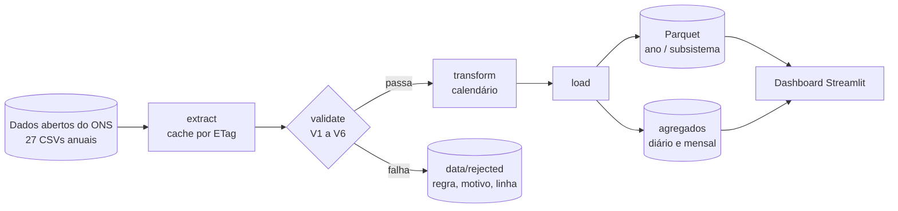

# energy-load-etl

Pipeline batch de 26 anos de dados de carga de energia do Brasil, do CSV bruto até um
dashboard em produção.

**[Dashboard no ar](https://energia.gabrielfdev.com)** · 


[English version](README.md)

933.880 medições horárias publicadas pelo ONS, baixadas com invalidação de cache,
passadas por seis regras de validação, gravadas em Parquet particionado e servidas por um
dashboard Streamlit que se atualiza sozinho duas vezes por dia.

O que não passa na validação não some em silêncio. Vai para um relatório de qualidade com
a regra que pegou, o motivo, e a linha do arquivo de onde veio.

## O problema

O Brasil publica seu consumo de eletricidade abertamente, um CSV por ano desde 2000. É um
dado bom, e parece simples: quatro colunas, uma linha por hora por subsistema. É só
carregar.

Só que não é, e o motivo está nos timestamps. É disso que este projeto trata de verdade.

## Como funciona



Um comando roda tudo:

```bash
uv run python -m energy_load_etl.pipeline
```

Leva uns 6 segundos para os 27 anos com os arquivos em cache, e grava 933.620 linhas
aprovadas em 108 partições Parquet.

## A parte interessante

O Brasil teve horário de verão até 2019. O plano deste projeto dizia que existiria um dia
de 23 horas e um de 25 por ano. Metade disso era falso, e descobrir foi a melhor coisa que
aconteceu aqui.

**Dias de 25 horas não existem nos arquivos.** Na volta do horário de verão, em fevereiro,
as 23:00 aconteciam duas vezes, com cargas diferentes. O formato do ONS usa o timestamp
local como chave e não tem onde guardar as duas, então uma medição real foi descartada na
origem. São exatamente 4 horas perdidas por ano, uma por subsistema, em todos os anos de
2000 a 2019, e zero de 2020 em diante, quando o país acabou com o horário de verão. O
pipeline detecta isso só a partir do dado, o que significa que ele reconstruiu uma mudança
de política pública a partir de um formato de arquivo.

**Dias de 23 horas existem, mas só até 2013.** Na entrada do horário de verão, em outubro,
o ONS simplesmente não gravava a linha que faltava. De 2014 em diante ele passou a gravar
a linha com o campo vazio, e o dia volta a ter 24. Em 04/11/2018, três subsistemas vieram
em branco e o Sul veio com `0E-8`.

A consequência atravessa o código inteiro: **nenhuma contagem funciona.** Não existe "24
linhas por dia" nem "8.760 por ano" que valha para todos os anos, porque existe linha que
não é hora e hora que não tem linha.

Então nada aqui conta linha. A validação pede ao `zoneinfo` a grade de instantes que
realmente existiram no relógio local e subtrai o que chegou. Nenhuma data de horário de
verão aparece no código, e a mesma função responde tanto "faltou alguma hora?" quanto
"esse dia está inteiro?". Dois caminhos de código independentes, um número só: as horas
faltantes somadas no agregado diário dão 368, e a validação reporta 368.

## As validações

Rodam nesta ordem. As cinco primeiras bloqueiam a linha, a sexta marca.

| Regra | O que confere | Efeito |
|---|---|---|
| V1 | Schema: 4 colunas com os tipos do contrato | bloqueia o arquivo |
| V2 | Código do subsistema em {N, NE, S, SE} | bloqueia a linha |
| FUSO | Instante que nunca existiu no relógio local | bloqueia a linha |
| V5 | Valor ausente | bloqueia a linha |
| V3 | Unicidade de (subsistema, instante localizado) | bloqueia a linha |
| V5 | Faixa física, 0 < carga < 120.000 MWmed | bloqueia a linha |
| V4 | Continuidade do calendário contra a grade real do fuso | reporta o buraco |
| V6 | Salto atípico entre horas consecutivas | marca para revisão |

A ordem importa. O tratamento de fuso roda antes da faixa física porque, na entrada do
horário de verão, o Sul reporta `0E-8` para a hora que não existiu. Rejeitar isso como
"carga zero é impossível" daria o veredito certo pelo motivo errado: o problema não é o
valor, é o instante. Validação na ordem errada produz explicação falsa.

A separação entre regra dura e regra de alerta é proposital. A V6 não rejeita nada, porque
o valor está correto. O que fugiu do padrão foi o que aconteceu naquela hora.

## O que o dado revelou

Encontrado pelo pipeline, sem ninguém procurar.

**Três dias inteiros sem medição nenhuma**: 01/12/2013, 01/02/2014 e 09/04/2015. Em dois
deles o Norte não tem nem linha, enquanto os outros três têm linha com campo vazio. Esses
dias aparecem no agregado diário com `horas_presentes = 0` e medidas nulas, em vez de
sumirem, para o gráfico desenhar um buraco em vez de uma reta.

**Os dez maiores saltos em 26 anos são quatro apagões e seis jogos de Copa do Mundo.** Os
apagões: 21/01/2002, 10/11/2009 (o maior da história do país), 28/08/2013 e 21/03/2018. Os
jogos aparecem todos às 18:00, no Sudeste, como subida entre 7.283 e 9.022 MWmed. Parar
para assistir é gradual; voltar ao trabalho é abrupto, e é a retomada que dispara a regra.

**Abril de 2020 no subsistema Norte** tem o triplo da variabilidade normal de hora para
hora, sustentado por um mês, com volta ao normal em maio. Lockdown explicaria queda de
nível, não triplicação da variabilidade. Causa desconhecida, e fica no relatório como
pergunta em aberto.

## Como rodar

Precisa de [uv](https://docs.astral.sh/uv/) e Python 3.12.

```bash
git clone https://github.com/dev-gabrielferreira/energy-load-etl.git
cd energy-load-etl
uv sync

uv run python -m energy_load_etl.pipeline     # baixa, valida, grava o Parquet
uv run streamlit run dashboard/app.py         # dashboard em localhost:8501
```

A primeira execução baixa uns 39 MB do bucket S3 do ONS. Depois disso o extract compara
ETags e só baixa de novo o ano cujo arquivo remoto mudou, o que acontece mais do que se
imagina: o ONS revisa dado já publicado.

```bash
uv run python -m energy_load_etl.pipeline --sem-download   # usa o que está em data/raw
uv run python -m energy_load_etl.pipeline --anos 2018 2019 # anos específicos
uv run pytest                                              # 56 testes
```

## O que ele grava

| Caminho | Conteúdo |
|---|---|
| `data/raw/` | CSVs como o ONS publicou, nunca editados |
| `data/processed/horario/ano=YYYY/id_subsistema=XX/` | dado horário, 933.620 linhas em 108 partições |
| `data/processed/diario/`, `mensal/` | agregados, cada linha declarando de quantas horas é feita |
| `data/processed/qualidade/` | linhas lidas, aprovadas e rejeitadas, ano a ano |
| `data/rejected/` | cada linha rejeitada com regra e linha de origem, mais um relatório em Markdown |

O Parquet ocupa 33 MB contra 39 MB de CSV bruto, carregando doze colunas a mais. `data/`
está no gitignore e nada dali é commitado.

## Agregados que dizem de que são feitos

Toda linha das tabelas diária e mensal carrega `horas_esperadas`, `horas_presentes` e
`completo`. O esperado vem da grade do fuso, nunca de um 24 escrito no código, e isso
importa em 39 dias do histórico: 20 dias de 25 horas e 19 de 23.

Sem isso, um dia que perdeu seis horas produziria uma média que parece tão sólida quanto a
de um dia inteiro. O mensal é calculado do horário, e não da tabela diária, porque média
de médias diárias pesaria um dia de seis horas igual a um dia completo.

## Estrutura

```
src/energy_load_etl/
├── config.py      constantes, caminhos, limiares
├── extract.py     download com cache por ETag, leitura do CSV, localização de fuso
├── validate.py    V1 a V6
├── transform.py   a grade do fuso e as features de calendário
├── aggregate.py   diário e mensal, com completude
├── load.py        Parquet particionado, escrita idempotente
└── pipeline.py    ponto de entrada único
dashboard/app.py   Streamlit, lê só data/processed
tests/             56 testes, fixtures sintéticas, datas reais de horário de verão
```

Cada módulo faz uma coisa e é testável sozinho.

## Testes

```bash
uv run pytest
```

56 testes sobre fixtures sintéticas pequenas o bastante para serem lidas. Todo caso que
está nelas foi observado no dado real do ONS antes de virar teste, e os casos de horário
de verão usam as datas verdadeiras, porque testar contra data inventada não provaria que o
código conversa certo com o banco de fusos.

## Deploy

Dois containers da mesma imagem, atrás do Caddy. O pipeline reprocessa a cada 12 horas e
escreve num volume; o dashboard lê esse volume e serve a página. Passo a passo completo em
[docs/DEPLOY.md](docs/DEPLOY.md).

Um detalhe que vale saber para qualquer container que lide com tempo: a imagem
`python:3.12-slim` não traz o banco de fusos horários. Sem o `tzdata`, o `zoneinfo` não
conhece `America/Sao_Paulo` e este pipeline morre na primeira linha que tenta localizar um
instante.

## Decisões

Cada escolha, com o que foi rejeitado e por quê, está em
[docs/decisions.md](docs/decisions.md). Entre elas: pandas em vez de Polars, Parquet em vez
de CSV, pastas de partição explícitas em vez de `partition_cols`, manter o rótulo de fuso
local em vez de UTC, e por que as linhas rejeitadas são guardadas em vez de descartadas.

## Fonte dos dados

[Curva de Carga Horária](https://dados.ons.org.br/dataset/curva-carga-ho), publicada pelo
Operador Nacional do Sistema Elétrico (ONS) sob licença CC-BY. Este projeto não é um
produto oficial do ONS.
