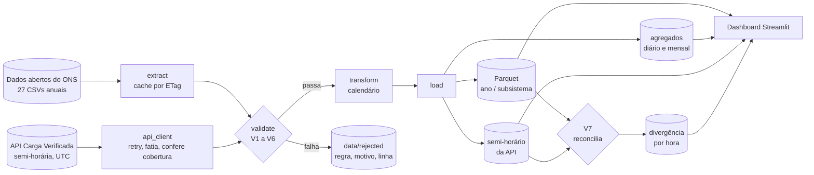

# energy-load-etl

Pipeline batch de 26 anos de dados de carga de energia do Brasil, do CSV bruto até um
dashboard em produção.

**[Dashboard no ar](https://energia.gabrielfdev.com)** · 


[English version](README.md)

933.880 medições horárias publicadas pelo ONS, baixadas com invalidação de cache,
passadas por sete regras de validação, gravadas em Parquet particionado e servidas por um
dashboard Streamlit.

São duas fontes. Os arquivos anuais em CSV são o histórico, e chegam com alguns dias de
atraso. Uma API REST de medições semi-horárias cobre esse buraco e é buscada a cada três
horas. As duas passam pelo mesmo funil de validação e ficam em tabelas separadas, porque
descobrimos que elas não medem a mesma coisa.

O que não passa na validação não some em silêncio. Vai para um relatório de qualidade com
a regra que pegou, o motivo, e a linha do arquivo de onde veio.

## O problema

O Brasil publica seu consumo de eletricidade abertamente, um CSV por ano desde 2000. É um
dado bom, e parece simples: quatro colunas, uma linha por hora por subsistema. É só
carregar.

Só que não é, e o motivo está nos timestamps. É disso que este projeto trata de verdade.

## Como funciona



Dois comandos, um por fonte:

```bash
uv run python -m energy_load_etl.pipeline                # os 27 arquivos anuais
uv run python -m energy_load_etl.pipeline --incremental  # os últimos 30 dias, via API
```

A passada completa leva uns 6 segundos para os 27 anos com os arquivos em cache, e grava
933.620 linhas aprovadas em 108 partições Parquet. A incremental leva uns segundos e não
toca no histórico.

## A parte interessante

O Brasil teve horário de verão até 2019. O plano deste projeto dizia que existiria um dia
de 23 horas e um de 25 por ano. Metade disso era falso, e descobrir foi a melhor coisa que
aconteceu aqui.

**Dias de 25 horas não existem nos arquivos.** Na volta do horário de verão, em fevereiro,
as 23:00 aconteciam duas vezes, com cargas diferentes. O formato do ONS usa o timestamp
local como chave e não tem onde guardar as duas, então uma medição real foi descartada na
origem. São exatamente 4 horas perdidas por ano, uma por subsistema, em todos os anos de
2000 a 2019, e zero de 2020 em diante, quando o país acabou com o horário de verão. O
pipeline detecta isso só a partir do dado, o que significa que ele reconstruiu uma mudança
de política pública a partir de um formato de arquivo.

**Dias de 23 horas existem, mas só até 2013.** Na entrada do horário de verão, em outubro,
o ONS simplesmente não gravava a linha que faltava. De 2014 em diante ele passou a gravar
a linha com o campo vazio, e o dia volta a ter 24. Em 04/11/2018, três subsistemas vieram
em branco e o Sul veio com `0E-8`.

A consequência atravessa o código inteiro: **nenhuma contagem funciona.** Não existe "24
linhas por dia" nem "8.760 por ano" que valha para todos os anos, porque existe linha que
não é hora e hora que não tem linha.

Então nada aqui conta linha. A validação pede ao `zoneinfo` a grade de instantes que
realmente existiram no relógio local e subtrai o que chegou. Nenhuma data de horário de
verão aparece no código, e a mesma função responde tanto "faltou alguma hora?" quanto
"esse dia está inteiro?". Dois caminhos de código independentes, um número só: as horas
faltantes somadas no agregado diário dão 368, e a validação reporta 368.

## A segunda fonte, e o que custa confiar nela

A API de Carga Verificada quase não tem documentação, então a primeira coisa foi ir lá
descobrir. Cada linha abaixo foi medida contra a API real, e todas mudaram o código.

**Ela responde HTTP 200 para tudo.** Área desconhecida, data inválida, intervalo
invertido, ano sem dado: todos devolvem `200` com `[ ]`. Não existe sinalização de erro
nenhuma, o que significa que um engano nosso vira dado faltando sem nada apontando a
causa. Por isso todo pedido é conferido localmente antes de sair da máquina, e resposta
vazia é tratada como anomalia a reportar, nunca como sucesso.

**Ela corta janela longa em silêncio.** Uma resposta nunca traz mais de 4.944 registros,
que são 103 dias de meias-horas. Pedindo mais, ela devolve `200` com o **fim** da janela
cortado fora, que é exatamente a parte recente que uma carga incremental quer. Pedindo 150
dias vieram os 103 primeiros e os 47 últimos sumiram sem uma palavra. O cliente fatia todo
pedido em 30 dias e depois compara as datas que voltaram com as datas que foram pedidas.
Essa conferência é a única coisa entre este pipeline e meses de dado calado pela metade.

**O JSON dela é inválido em datas antigas.** `"val_cargaglobalsmmgd": ,` sem valor nenhum,
uns cem por dia entre 2016 e 2019, sempre nos campos de geração distribuída, que ainda não
existia. O `json.loads` recusa, então o `resposta.json()` nunca é usado: o corpo é lido
como texto, o campo vazio vira `null`, e a contagem de reparos sobe para o relatório de
qualidade. Consertar dado dos outros em silêncio é como um pipeline começa a mentir.

**Ela enche o futuro de zero.** A API pré-cria as 48 meias-horas do dia corrente e
preenche com `0.0` as que ainda não aconteceram. Ninguém foi procurar isso: a V5 pegou na
primeira execução de verdade, às 22h, rejeitando as fatias de 22:30 à meia-noite dos
quatro subsistemas. É a mesma mentira que o arquivo anual conta com `0E-8`, em outro
formato. Quem tirar a média do dia corrente sem regra de faixa física divide por 48
medições tendo medido menos, todo dia, sem sintoma nenhum.

**Ela guardou a hora que o arquivo jogou fora.** Chaveada em UTC, ela não tem o problema
de formato que domina o resto deste projeto: na volta do horário de verão as duas leituras
das 23:00 têm carimbos UTC diferentes e cabem as duas. Em 17/02/2018 e 16/02/2019 o dia
chega com 50 registros em vez de 48. A V7 recuperou **37.797,471 MWmed às 23:00 de
17/02/2018**, uma medição real que não existe no arquivo anual. Em 2016 e 2017 o dia chega
com 48: nesses dois anos a hora se perdeu na API também.

## As duas fontes discordam, e a discordância tem forma

Esta é a parte que mudou o desenho. Em 35.040 horas de sobreposição, um ano inteiro, a API
lê mais alto que o arquivo: +5,0% no Sudeste, +4,3% no Nordeste, +2,7% no Sul e +1,4% no
Norte.

A diferença é a soma de duas coisas. Uma parte é constante e continua lá às três da manhã,
com o sol posto. A outra se move ao longo do dia, com vale de manhã cedo e pico à tarde.
Essa segunda parte acompanha a geração em telhado com painel solar, a chamada geração
distribuída: ela nunca passa pela rede, então o arquivo anual não a enxerga, e a API a
estima e soma.

Ou seja, nenhuma das duas está errada, e o pipeline não escolhe uma vencedora. Elas
respondem perguntas diferentes: o arquivo diz quanta energia passou pela rede, a API diz
quanta energia foi consumida. Elas ficam em tabelas separadas, e é essa separação que
impede 26 anos de série histórica de ganharem um degrau de 5% no dia em que a segunda
fonte entrou.

Uma parte continua sem explicação: o Norte passa boa parte do dia **abaixo** de zero, ou
seja, ali a API lê menos que o arquivo. Geração distribuída não dá conta disso. Fica
anotado como pergunta em aberto, do lado de abril de 2020, e não como conclusão.

## As validações

Rodam nesta ordem. As cinco primeiras bloqueiam a linha, a sexta marca.

| Regra | O que confere | Efeito |
|---|---|---|
| V1 | Schema: 4 colunas com os tipos do contrato | bloqueia o arquivo |
| V2 | Código do subsistema em {N, NE, S, SE} | bloqueia a linha |
| FUSO | Instante que nunca existiu no relógio local | bloqueia a linha |
| V5 | Valor ausente | bloqueia a linha |
| V3 | Unicidade de (subsistema, instante localizado) | bloqueia a linha |
| V5 | Faixa física, 0 < carga < 120.000 MWmed | bloqueia a linha |
| V4 | Continuidade do calendário contra a grade real do fuso | reporta o buraco |
| V6 | Salto atípico entre horas consecutivas | marca para revisão |
| V7 | API contra arquivo: cobertura, e divergência por hora | marca e reporta |

A ordem importa. O tratamento de fuso roda antes da faixa física porque, na entrada do
horário de verão, o Sul reporta `0E-8` para a hora que não existiu. Rejeitar isso como
"carga zero é impossível" daria o veredito certo pelo motivo errado: o problema não é o
valor, é o instante. Validação na ordem errada produz explicação falsa.

A separação entre regra dura e regra de alerta é proposital. A V6 não rejeita nada, porque
o valor está correto. O que fugiu do padrão foi o que aconteceu naquela hora.

A V7 tem duas metades de naturezas bem diferentes. Cobertura é fato duro e não precisa de
limiar nenhum: ou a hora está nas duas fontes, ou não está. É ali que a hora recuperada do
horário de verão aparece. A divergência numérica é sempre calculada e reportada, e marcada
só quando sai da faixa medida para aquele subsistema **naquela hora do dia**. Faixa única
por subsistema foi tentada e rejeitada: ela punha 100% das marcações entre 7h e 14h, ou
seja, estava medindo o sol e não anomalia.

Essa faixa também é a única regra do projeto que envelhece. Geração distribuída continua
sendo instalada, então a diferença cresce junto, e uma faixa medida hoje fica apertada em
dois anos. A taxa da calibragem mora no `config.py` ao lado da tabela, e o relatório
compara cada execução com ela: se as marcações dispararem, o diagnóstico é "a régua ficou
velha", não "o dado piorou". Regra calibrada que não sabe dizer quando precisa ser
remedida vira alarme que ninguém escuta.

## O que o dado revelou

Encontrado pelo pipeline, sem ninguém procurar.

**Três dias inteiros sem medição nenhuma**: 01/12/2013, 01/02/2014 e 09/04/2015. Em dois
deles o Norte não tem nem linha, enquanto os outros três têm linha com campo vazio. Esses
dias aparecem no agregado diário com `horas_presentes = 0` e medidas nulas, em vez de
sumirem, para o gráfico desenhar um buraco em vez de uma reta.

**Os dez maiores saltos em 26 anos são quatro apagões e seis jogos de Copa do Mundo.** Os
apagões: 21/01/2002, 10/11/2009 (o maior da história do país), 28/08/2013 e 21/03/2018. Os
jogos aparecem todos às 18:00, no Sudeste, como subida entre 7.283 e 9.022 MWmed. Parar
para assistir é gradual; voltar ao trabalho é abrupto, e é a retomada que dispara a regra.

**Abril de 2020 no subsistema Norte** tem o triplo da variabilidade normal de hora para
hora, sustentado por um mês, com volta ao normal em maio. Lockdown explicaria queda de
nível, não triplicação da variabilidade. Causa desconhecida, e fica no relatório como
pergunta em aberto.

## Como rodar

Precisa de [uv](https://docs.astral.sh/uv/) e Python 3.12.

```bash
git clone https://github.com/dev-gabrielferreira/energy-load-etl.git
cd energy-load-etl
uv sync

uv run python -m energy_load_etl.pipeline     # baixa, valida, grava o Parquet
uv run streamlit run dashboard/app.py         # dashboard em localhost:8501
```

A primeira execução baixa uns 39 MB do bucket S3 do ONS. Depois disso o extract compara
ETags e só baixa de novo o ano cujo arquivo remoto mudou, o que acontece mais do que se
imagina: o ONS revisa dado já publicado.

```bash
uv run python -m energy_load_etl.pipeline --sem-download     # usa o que está em data/raw
uv run python -m energy_load_etl.pipeline --anos 2018 2019   # anos específicos
uv run python -m energy_load_etl.pipeline --incremental      # últimos 30 dias, via API
uv run python -m energy_load_etl.pipeline --incremental --dias 7
uv run pytest                                                # 92 testes
```

O modo incremental é função separada atrás de flag separada, e o `executar` não chama a
API em lugar nenhum. É essa a garantia de que a API fora do ar não derruba o histórico, e
ela é mais forte que envolver a chamada num `try`: não existe exceção de API para escapar,
porque não há código de API rodando naquele caminho. Verificado apontando a URL para um
host inexistente: o incremental falhou em 5,4 segundos sem levantar exceção, e os arquivos
anuais processaram normalmente.

## O que ele grava

| Caminho | Conteúdo |
|---|---|
| `data/raw/` | CSVs como o ONS publicou, nunca editados |
| `data/processed/horario/ano=YYYY/id_subsistema=XX/` | dado horário, 933.620 linhas em 108 partições |
| `data/processed/diario/`, `mensal/` | agregados, cada linha declarando de quantas horas é feita |
| `data/processed/verificada/ano=YYYY/id_subsistema=XX/` | dado semi-horário da API, janela móvel dos últimos 30 dias |
| `data/processed/reconciliacao/` | saída da V7, uma linha por hora comparada com sua divergência |
| `data/processed/qualidade/`, `qualidade_api/` | linhas lidas, aprovadas e rejeitadas, por ano e por execução incremental |
| `data/rejected/` | cada linha rejeitada com regra e linha de origem, mais um relatório em Markdown por fonte |

O Parquet ocupa 33 MB contra 39 MB de CSV bruto, carregando doze colunas a mais. `data/`
está no gitignore e nada dali é commitado.

## Agregados que dizem de que são feitos

Toda linha das tabelas diária e mensal carrega `horas_esperadas`, `horas_presentes` e
`completo`. O esperado vem da grade do fuso, nunca de um 24 escrito no código, e isso
importa em 39 dias do histórico: 20 dias de 25 horas e 19 de 23.

Sem isso, um dia que perdeu seis horas produziria uma média que parece tão sólida quanto a
de um dia inteiro. O mensal é calculado do horário, e não da tabela diária, porque média
de médias diárias pesaria um dia de seis horas igual a um dia completo.

## Estrutura

```
src/energy_load_etl/
├── config.py      constantes, caminhos, limiares
├── extract.py     download com cache por ETag, leitura do CSV, localização de fuso
├── api_client.py  a API REST: retry, fatiamento, conferência de cobertura, reparo de JSON
├── validate.py    V1 a V7
├── transform.py   a grade do fuso e as features de calendário
├── aggregate.py   diário e mensal, com completude
├── load.py        Parquet particionado, escrita idempotente
└── pipeline.py    ponto de entrada único, dois modos
dashboard/app.py   Streamlit, lê só data/processed
tests/             92 testes, fixtures sintéticas, datas reais de horário de verão, sem rede
```

Cada módulo faz uma coisa e é testável sozinho.

## Testes

```bash
uv run pytest
```

92 testes sobre fixtures sintéticas pequenas o bastante para serem lidas. Todo caso que
está nelas foi observado no dado real do ONS antes de virar teste, e os casos de horário
de verão usam as datas verdadeiras, porque testar contra data inventada não provaria que o
código conversa certo com o banco de fusos.

## Deploy

Dois containers da mesma imagem, atrás do Caddy. O container do pipeline roda dois ritmos
num loop só, porque as duas fontes mudam em cadências diferentes: reprocessamento completo
a cada 12 horas, que é a frequência com que o ONS republica os arquivos anuais, e passada
na API a cada 3 horas. Ele escreve num volume; o dashboard lê esse volume e serve a
página. Passo a passo completo em [docs/DEPLOY.md](docs/DEPLOY.md).

Um detalhe que vale saber para qualquer container que lide com tempo: a imagem
`python:3.12-slim` não traz o banco de fusos horários. Sem o `tzdata`, o `zoneinfo` não
conhece `America/Sao_Paulo` e este pipeline morre na primeira linha que tenta localizar um
instante.

## Decisões

Cada escolha, com o que foi rejeitado e por quê, está em
[docs/decisions.md](docs/decisions.md). Entre elas: pandas em vez de Polars, Parquet em vez
de CSV, pastas de partição explícitas em vez de `partition_cols`, manter o rótulo de fuso
local em vez de UTC, e por que as linhas rejeitadas são guardadas em vez de descartadas.

## Fonte dos dados

[Curva de Carga Horária](https://dados.ons.org.br/dataset/curva-carga-ho), publicada pelo
Operador Nacional do Sistema Elétrico (ONS) sob licença CC-BY. Este projeto não é um
produto oficial do ONS.
